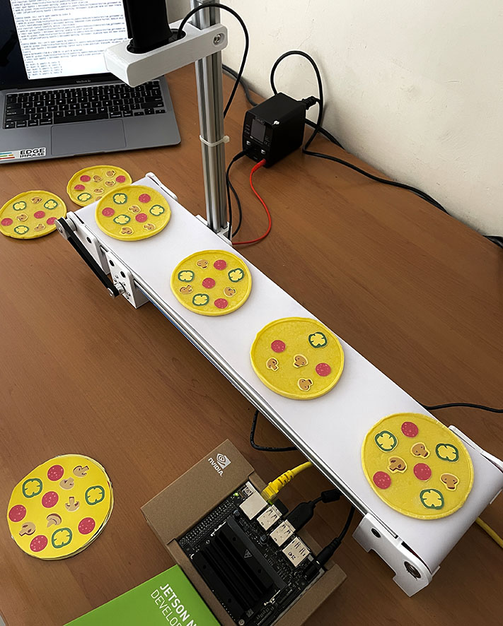

# PizzaQC_Conveyor_Belt
A computer vision system for quality/quantity inspection of product manufacturing on a conveyor belt.

## Problem:
The QC process if handled by human, especially involving visual based calculation and carried out repeatedly is time consume and prone to errors. Using sensors to calculate also does not provide a solution if the object you want to detect is an object that has multiple components in it; such as in food or electronic manufactures by monitoring the number of components in a product.

## Our Solution:
A computer vision system for quality/quantity inspection of product manufacturing on a conveyor belt. The setting of this project will be in a pizza factory where a Jetson Nano with a camera will detect and count the number of toppings for each pizza that passes on a conveyor belt to ensure the quantity of toppings (pepperoni, mushroom, and paprika) meets a predefined quality standard. Speed, reliability, and cost efficiency are the goals for this project.

## Description:
This project uses Edge Impulse’s FOMO (Faster Objects, More Objects) which can quickly detect objects and use them as a quality/quantity check for products on a running conveyor belt. FOMO's ability to know the number and position of coordinates of an object is the basis of this system. This project will explore the capability of NVIDIA Jetson Nano’s GPU to handle color video (RGB) with a higher resolution (320x320) while still maintaining high inference speed. The ML model (model.eim) will be deployed with the TensorRT library which will be compiled with optimizations for the GPU which will be setup via the Linux C++ SDK. Once the model can identify different pizza toppings, an additional Python program will be added, so it’s able to check each pizzas to see whether it meets the standard quantity of pepperonis, mushrooms, and paprikas. This project is a proof-of-concept that can be widely applied in the product manufacturing and food production industries to perform quality check based on the quantity requirements of objects in each product.

Inferencing Time test in Jetson Nano's GPU:

